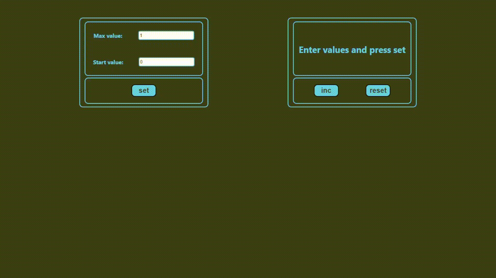

  _"If you can't count to ten_ 
  _but still dream of becoming a programmer,_ 
  _create a counter that will do it for you!"_ 
  - Steve Jobs - 

# Counter

## Description

The "Counter" project was created as part of an educational process. The main task was to develop an interactive counter with the ability to set minimum and maximum values. The project also includes error handling, such as situations where the maximum value is less than the minimum value. Users receive text notifications, and the counter buttons become inactive.

## Features

- Setting minimum and maximum values.
- Error handling, including text notifications and button disabling.
- Storing data in LocalStorage.
- Interface design and styling.

## Project Goal

The goal of this educational project was to apply acquired knowledge and practical skills in frontend development. The project helped deepen knowledge in working with React, Redux, and LocalStorage, as well as develop a clear user interface using HTML and CSS.

## Technology Stack

- React with TypeScript.
- Redux for state management.
- LocalStorage for storing configuration values.

    

## Installation and Running

To install and run the project locally, follow these steps:

1. Clone the repository to your computer.
2. In the terminal, navigate to the project folder.
3. Install dependencies using the following command:
4. Start the project with the command: yarn start
5. The deployed project can be found at the following link: ...
